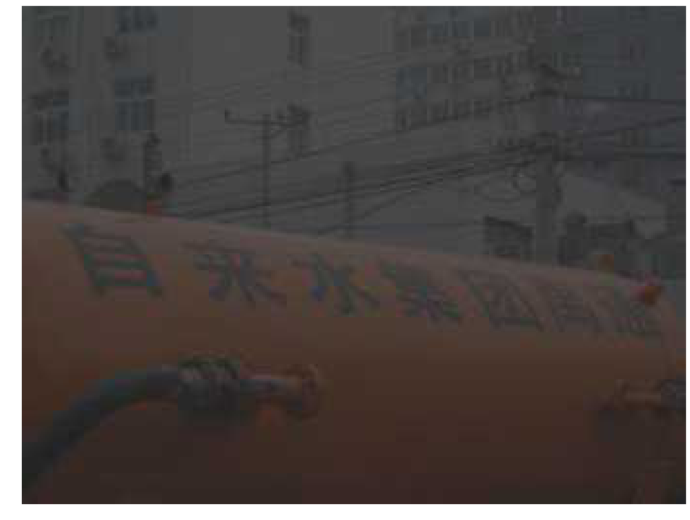
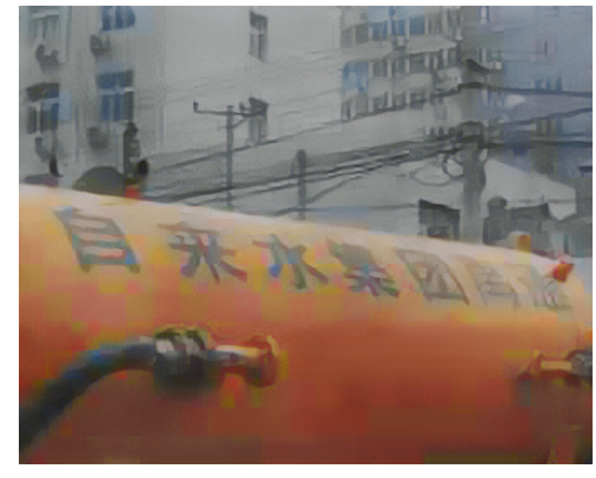
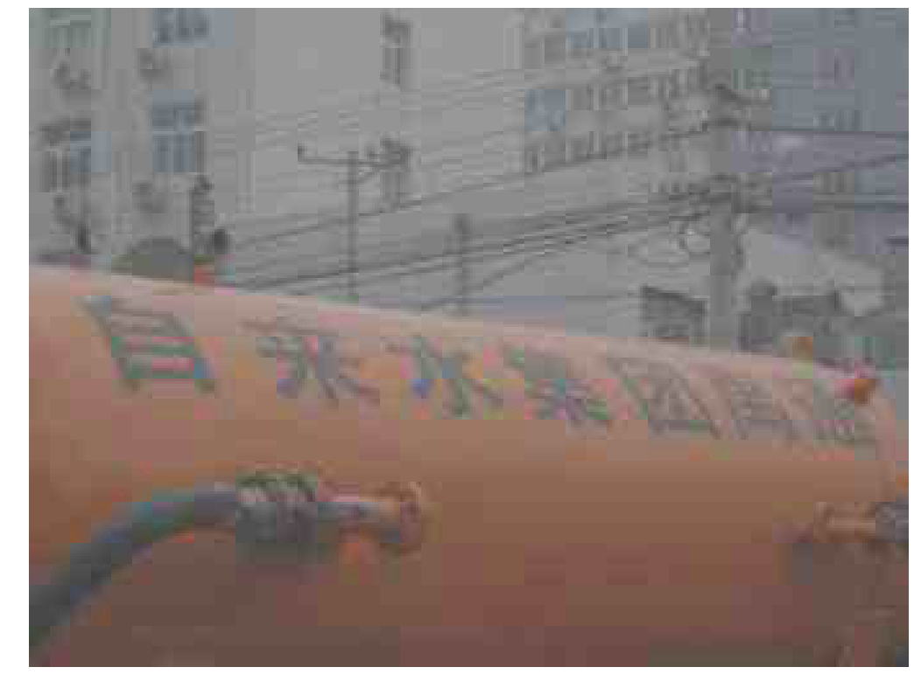
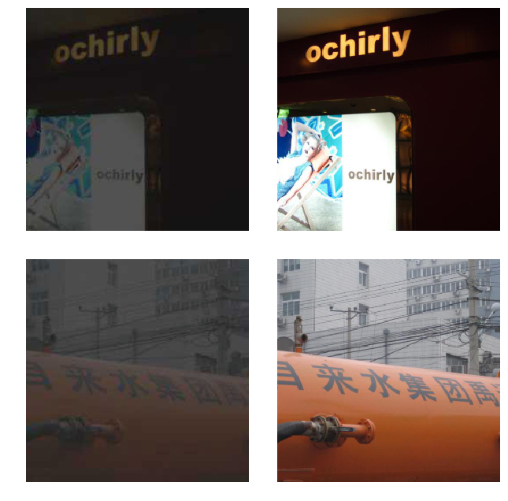
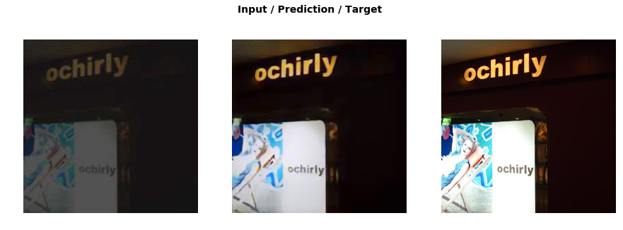

# Brighter

Sometimes there's something wrong with the image. Let's call these images 'low quality'. (For example watermark on the image, blurry, red eyes etc)

If I can convert the good images to low-quality images then I can reverse the process and improve the low-quality photos.

In order to make the model produce high quality results, I will need to create a custom loss function which incorporates feature loss (also known as perceptual loss), along with gram loss. These techniques can be used for many other types of image generation task, such as image colorization.

### Goal
1. Improve dark image quality
2. Improve OCR from the dark image

### Data
From [this](https://gengo.ai/datasets/15-best-ocr-handwriting-datasets/) list choosed MSRA Text Detection 500 Database [(MSRA-TD500)](http://www.iapr-tc11.org/mediawiki/index.php?title=MSRA_Text_Detection_500_Database_(MSRA-TD500)).

I ignored text boundix boxes and resized images to 512px.

### Lower the images quality
With python Pillow I changed the image resolution, brightness, contrast, sharpness and quality.
Samples are in [/imgs/](https://github.com/korjusk/Brighter/tree/master/imgs) directory.

Then I combined all the changes and made 2 datasets
Crappy quality vs normal

#### Results
Disclaimer: I trained it less than an hour and the whole project took 4 hours to make.

[Notebook](https://github.com/korjusk/Brighter/blob/master/notebook.ipynb)
#### Whats next?
Try to detect text from the crappy images, manually improved images, images improved with ML and original images.
Compare the results and conclude if its something to invest more time in.

